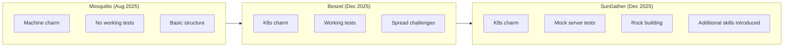

# sungather-k8s-operator

In this experiment, I had Claude Code build a Kubernetes charm for [SunGather](https://sungather.net), a data collection tool for Sungrow solar inverters. The application collects operational data via ModBus connections and exports it to MQTT, InfluxDB, PVOutput.org, and a built-in web interface.

(I have a Sungrow inverter and would like better access to the data than the app provides).

## Goals

* Continue iterating on the charm development process from the [beszel experiment](../2025-12-23-beszel-k8s-operator/).
* Test the new **skills** that were created for `charmcraft`, `jhack`, and `concierge`.
* Continue to improve integration testing, but not particularly with spread in this case.

This was not an original goal, but along the way I also added a goal of building a Rock (from necessity, but it's another interesting, charming adjacent, task).

## Setup

As with the beszel experiment, Claude ran in YOLO mode (`--dangerously-skip-permissions`) inside a [Multipass](https://canonical.com/multipass) virtual machine with [Concierge](https://github.com/canonical/concierge) providing a fully bootstrapped Juju environment (`concierge prepare -p dev`).

### Skills

This experiment introduced three new **skills** for Claude Code:

| Skill | Purpose |
|-------|---------|
| **charmcraft** | Expert guidance for building, testing, and publishing charms |
| **jhack** | Utilities for debugging charms, inspecting relations, and rapid iteration |
| **concierge** | Environment provisioning for charm development |

Each skill includes:
- A `SKILL.md` file with comprehensive command references
- Reference documentation for configuration and troubleshooting
- Example workflows and best practices

The skills were installed in `.claude/skills/` within the experiment directory. See [INSTALL-SKILLS.md](https://github.com/tonyandrewmeyer/sungather-k8s-operator/blob/main/INSTALL-SKILLS.md) in the repository for installation instructions.

<!-- TODO: Add observations about whether the skills were actively triggered/used by Claude during development. Did Claude reference them? Did they improve the quality of charmcraft/jhack commands? -->

### CLAUDE.md Updates

The `CLAUDE.md` file was largely unchanged from the `beszel` experiment, maintaining the same guidance about:
- Using `ops.testing` (not Harness) for unit tests
- Using Jubilant (not pytest-operator) for integration tests
- Following the "testing sandwich" pattern
- Code style guidelines (British English, type hints, etc.)

## Results

The [full transcripts](https://tonyandrewmeyer.github.io/sungather-k8s-operator/) are available, made pretty by [Simon Willison's claude-code-transcripts tool](https://simonwillison.net/2025/Dec/25/claude-code-transcripts/). The final result is in the [sungather-k8s-operator repository](https://github.com/tonyandrewmeyer/sungather-k8s-operator).

### What Was Built

```
sungather-k8s-operator/
├── src/
│   ├── charm.py          # Main charm with config/action dataclasses
│   └── sungather.py      # Workload interaction module
├── tests/
│   ├── unit/             # 13 ops.testing unit tests
│   └── integration/
│       ├── test_charm.py           # 11 Jubilant integration tests
│       ├── test_charm_with_mock.py # 9 mock server tests
│       └── mock_sungrow/           # Mock inverter server
├── rock/                 # Custom OCI image definition
├── .github/workflows/    # CI/CD with rock building
└── [documentation files]
```

**Key statistics:**
- **50 commits** over multiple sessions
- **25 configuration options** covering inverter, MQTT, InfluxDB, PVOutput, and webserver settings
- **3 actions**: `run-once`, `test-connection`, `get-inverter-info`
- **Traefik ingress integration** for web UI access

The actions come directly from what the workload offers, but better charm design for the actual desired purpose would have had different ones.

### The Charm Plan

Claude produced a comprehensive [CHARM_PLAN.md](https://github.com/tonyandrewmeyer/sungather-k8s-operator/blob/main/CHARM_PLAN.md) covering:
- Why Kubernetes was chosen over machine charm
- Configuration options with justifications
- Secrets management for credentials
- Integration strategy (ingress, MQTT)
- Implementation phases
- Edge cases and testing strategy

This level of upfront planning, guided by the CLAUDE.md instructions to "ultrathink about a plan", produced a much more coherent architecture than simply diving into code.

## Lessons

### The Broken OCI Image Problem

The default upstream image (`bohdans/sungather:latest`) was broken - missing the `SungrowClient` Python module. I didn't know about this in advance - I had run the utility as a Python script, but not attempted to use the image.

Claude's solution was to build a custom Rock:

```bash
cd rock
rockcraft pack
# Produces sungather_0.3.8_amd64.rock (89MB)
```

The rock uses `uv` for dependency installation (~23ms) and includes all 20 required Python packages. This added significant complexity but demonstrates handling real-world workload issues.

### Mock Server for Integration Testing

Although I was able to test the charm against my actual inverter, that's obviously not available in CI. An additional challenge was to create a mock Sungrow inverter server for integration testing:

```
tests/integration/mock_sungrow/
├── registers.py      # Simulated register map (100+ registers)
├── modbus_server.py  # Modbus TCP on port 5020
├── http_server.py    # HTTP/WebSocket (WiNet-S) on port 8082
└── server.py         # Orchestration
```

This enables testing without physical hardware - realistic data, both protocols supported, pytest fixture integration. The mock server was verified working locally, though the full integration tests require pushing the rock to an accessible registry.

<!-- TODO: Describe the experience of requesting and iterating on the mock server implementation -->

### CI/CD Required Significant Debugging

The CI pipeline required **7 iterative fixes**:

1. LXD permission errors → `--destructive-mode`
2. File permissions → `sudo` with ownership correction
3. Ubuntu version mismatch → Changed to `ubuntu-22.04` runner
4. Docker image tagging → Extract image ID from `docker load`
5. Invalid charmcraft flag → Removed unsupported `--resource`
6. Charmcraft LXD issues → Applied `--destructive-mode`
7. Integration test environment → Same Ubuntu version fix

Each failure required Claude to analyse logs, understand the root cause, and propose fixes. This iterative debugging loop worked well, though it consumed significant context. Ideally, better instructions, templates, or skills would avoid needing this much work.

### Jubilant Integration Tests

The integration tests used [Jubilant](https://documentation.ubuntu.com/jubilant/) correctly this time:

```python
def test_deploy_with_config(juju: jubilant.Juju) -> None:
    juju.deploy(
        str(CHARM_PATH),
        config={"inverter-host": "192.168.1.100"},
        resources={"sungather-image": WORKING_IMAGE},
    )
    juju.wait(apps=["sungather-k8s"], status="blocked")
    # Assert on expected blocked status (no real inverter)
```

This is a significant improvement from the imagined Jubilant APIs in previous experiments.

### Path and Environment Issues

A debugging session was needed to fix workload startup:
- Incorrect file paths in charm code
- Broken virtualenv symlinks in the container
- Missing working directory specifications

The solution involved switching from a virtualenv to system Python and adding explicit working directory parameters to Pebble exec calls.

## What Worked Well

| Area | Observation |
|------|-------------|
| **Plan mode** | Comprehensive planning before implementation |
| **Testing sandwich** | Integration tests first, then implementation, then unit tests |
| **Rock building** | Successfully resolved broken upstream image |
| **Mock server** | Test infrastructure |
| **CI debugging** | Systematic approach to fixing pipeline issues |
| **Documentation** | README, TUTORIAL, CONTRIBUTING, SECURITY all created |

## What Needs Improvement

| Area | Observation |
|------|-------------|
| **Skills usage** | <!-- TODO: Add observations about whether skills were actively used --> |
| **CI iteration time** | Each fix required a full CI run to verify |
| **Registry complexity** | Getting rocks into K8s clusters remains fiddly |

## Comparison with Previous Experiments



The progression shows:
- **Mosquitto**: Foundation, identified many issues
- **Beszel**: Working K8s charm, struggled with spread
- **SunGather**: Most complete, handled real-world OCI issues, introduced skills

## Files of Interest

* [CHARM_PLAN.md](https://github.com/tonyandrewmeyer/sungather-k8s-operator/blob/main/CHARM_PLAN.md) - Comprehensive architecture planning
* [TESTING_SUMMARY.md](https://github.com/tonyandrewmeyer/sungather-k8s-operator/blob/main/TESTING_SUMMARY.md) - Mock server implementation details
* [MOCK_SERVER_SUMMARY.md](https://github.com/tonyandrewmeyer/sungather-k8s-operator/blob/main/MOCK_SERVER_SUMMARY.md) - Test infrastructure documentation
* [rock/rockcraft.yaml](https://github.com/tonyandrewmeyer/sungather-k8s-operator/tree/main/rock) - Custom OCI image definition

## Final Thoughts
